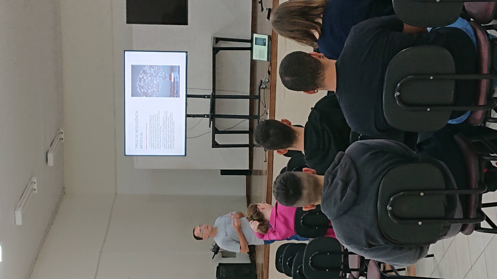
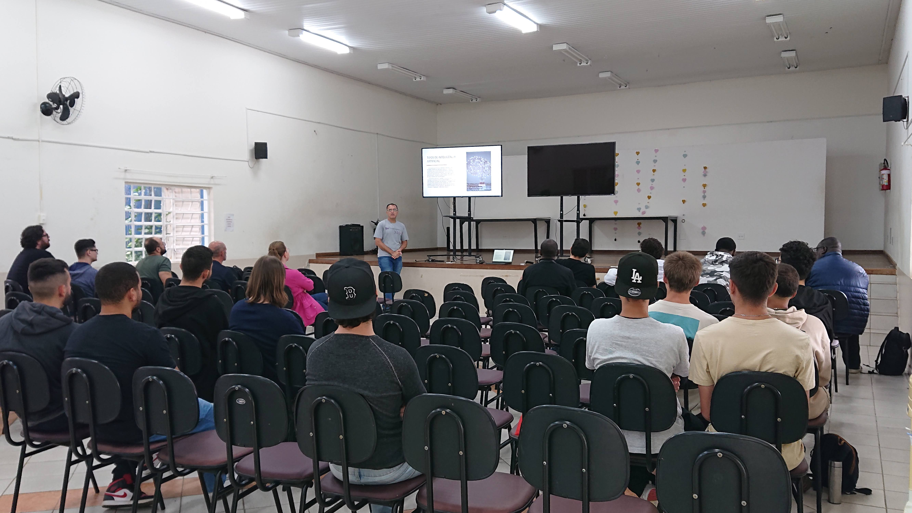
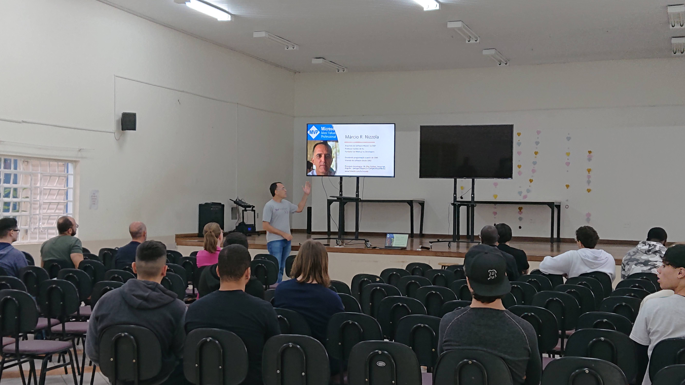
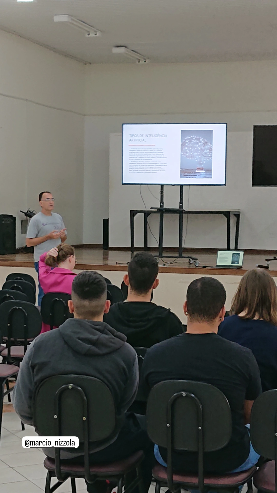
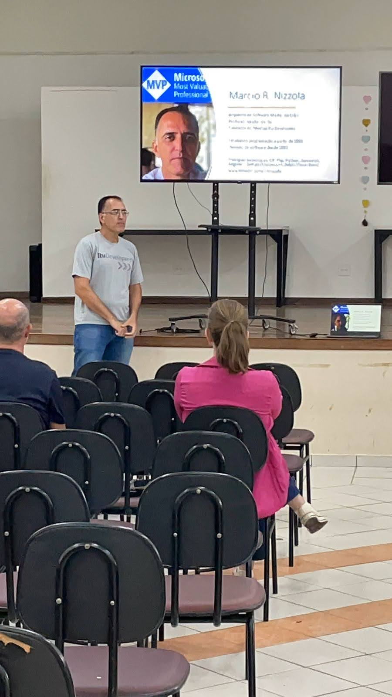
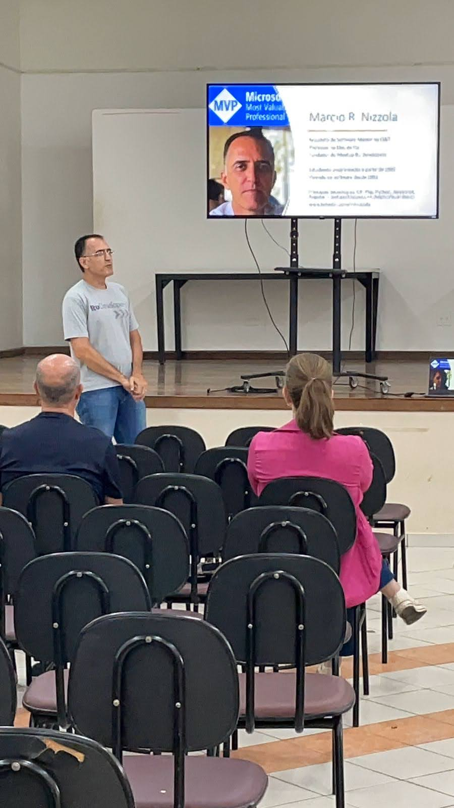
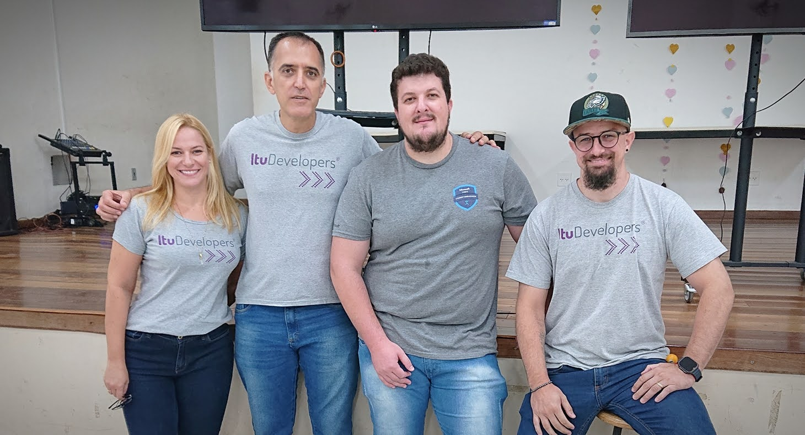
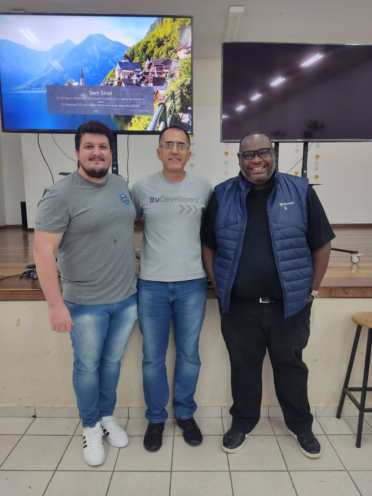
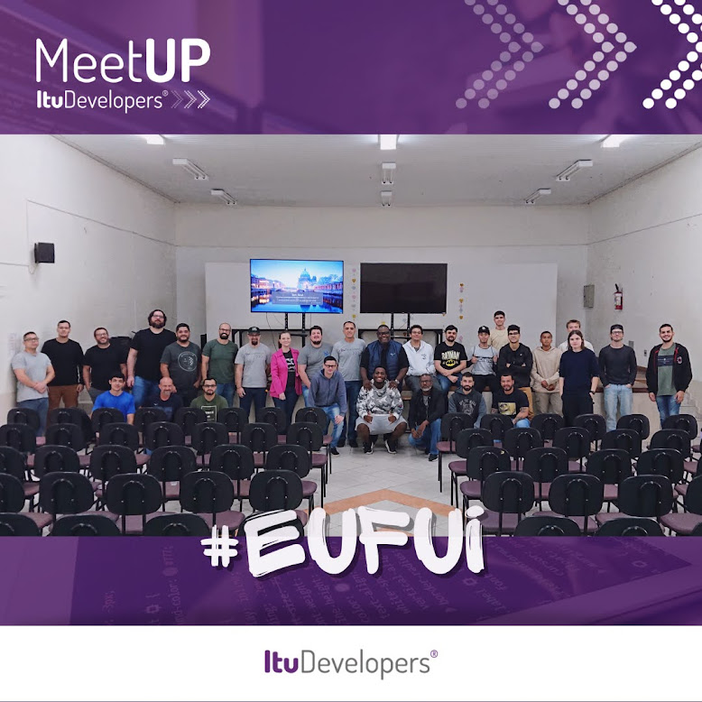

# 9meetupItuDevelopers
Palestra apresentada no 9º Meetup Itu Developers em 23/03/2024

# 9meetupItuDevelopers
Palestra apresentada no 9º Meetup Itu Developers em 23/03/2024

## Fotos da Palestra - "Como utilizar inteligência artificial numa aplicação .NET ?" de Márcio Rogério Nizzola
Foi abordado o uso da biblioteca Azure Open Ai, o serviço Azure Open Ai e programação .NET para consumir, criando API para pesquisa de defeitos em veiculos e também de roteiros turísticos baseados em I.A.

Aqui estão algumas fotos da apresentação:

## Pdf da palestra

## Fotos da Organização

Aqui estão algumas fotos da organização:

